# 炎龍騎士團2 逆向工程與重製 · fd2_re

1995 年漢堂國際的《炎龍騎士團2：黃金城傳說》是一款 DOS 戰棋 RPG。本專案分成兩條
明確的工作線：以合法原版檔案為 oracle 的反組譯／資料保存，以及不攜帶版權資產的
Go/Ebiten 重製引擎。兩者的完成度分開計算，不能把「格式已破解」宣稱成「遊戲已重製」。

## 目前狀態（2026-07-28）

| 領域 | 已驗證成果 | 與原版的差距 |
|---|---|---|
| 資產與格式 | DAT、FDTXT/字型、RLE、AFM/FIGANI、XMIDI、地圖資料可抽取／解碼 | 版權資產不入庫；部分資源的 runtime compositor 尚未接到 Ebiten |
| 反組譯與 SDD | FD2.EXE 的戰役狀態機、事件 handler、battle raw ABI、save envelope、item types5–24 與 UI input evidence 持續收斂 | indexed effect renderer、完整 postbattle/town 順序仍有 `[~]`／`[ ]` 項 |
| Go/Ebiten 引擎 | ch01 已能以原始 FDSHAP/FDICON/FDOTHER 組成 terrain→range→unit→foreground→HUD 的 320×200 indexed frame；steady selector 1 與 drawable target selectors 2–5 均使用原生 overlay；`0x24618` 9-pass transition已有strict runtime；獨立 ending oracle 可依原序跑完兩段對話、frame12..108、兩段 composite 與500-pass scroll | **尚非全 30 章原版等價可通關**；selector6 production owner、7+ target visual／游標 flash、`0x2c548` finale montage、campaign ending接線、音訊與跨平台 runtime 尚未閉合 |
| 原版視覺切片（不是整體 parity） | ch01 tactical/HUD、教會多個服務、action/command/item overlay；商店 purchase、sell與獨立equip均已有indexed production flow，另有部分戰鬥演出 fixture | 2026-07-28逐界面審計估計完整操作界面視覺還原約 **45–50%**；town、商店transfer、preparation、loadslots、ending仍未完整取代現代半透明框，不能稱原版視覺 parity |

Worklist 目前是 **475 個 `[x]`、97 個 `[~]`、69 個 `[ ]`**；這些是工程項目數，不是遊戲完成百分比。
可驗證的進度以 [`56` SDD](docs/knowledge-base/56-fd2-remake-sdd.md)、[`91` worklist](docs/knowledge-base/91-worklist.md)
與 [`42` gap audit](docs/knowledge-base/42-re-vs-remake-gap-audit.md) 為準。

視覺完成度必須另看 [`57` UI evidence matrix](docs/knowledge-base/57-ui-evidence-matrix.md)。
目前工程估計為：原始 asset/codec 可重現約 75–85%，可操作 state flow 約
50–55%，但完整玩家操作畫面的原版視覺還原只有約 35–40%。這些是依界面
證據分級的範圍，不是測試覆蓋率，也不能加總成遊戲完成百分比。

這組數字不能換算成「原版完成了幾％」：`[x]` 可能只代表一個格式、函式或 raw adapter 已通過證據 gate，
而不是一個章節已可通關。以玩家可見功能衡量，目前是「多個垂直切片」；30 章逐章的戰前／戰後、城鎮、商店、
整備、存檔與演出順序仍未逐章閉合。因此本專案目前與原版的主要差距不是素材解碼，而是 campaign runtime、
完整 UI／indexed effect renderer、音訊／DOS timing 與跨平台回歸。

2026-07-28 第一個原版 tactical-map production slice 已可見：合法原版資料經
all-or-nothing admission 後，`0x11cac` 的 terrain、range、unit、foreground、
HUD 與 VGA copy 會直接形成 Ebiten 畫面。重讀原始指令同時撤回舊的
「320×192 貼左上」斷言；正確契約是 312×192 貼到 VGA `(4,4)`。ch01 已接
18.2065Hz battle-local BIOS low-word clock與真正 constructor append order；
原版 setup 在 selector 0 的短暫 opening frame 後寫回可操作 selector 1；ch01 現已用
FDOTHER#1 descriptor 0 畫出原生 steady cursor，不再疊白色 approximation。target 模式的
drawable selectors 2–5 也已走相同 indexed compositor；selector 6的
terrain後field mutation已有failure-atomic compositor primitive，但尚未猜接其production owner；
7+ record-driven 值仍回到 playable renderer，
不能把這張圖解讀成整套戰場 UI 已完成。

### 為什麼最近看起來一直在反組譯、但進度沒有等比例前進

2026-07-27 審計確認：近期成果多是單一 offset 的 E0 raw slice 或錯誤斷言撤回，
尚未同時完成 runtime consumer、可重播輸入／狀態 trace 與 UI 截圖驗收；而
`remake/cmd/fd2/main.go` 仍是 scene、輸入、規則與 Draw 的集中 owner，30 章戰後
town/shop/church/preparation graph 也未逐章回歸。這是流程與架構瓶頸，不是 Docker、
Capstone 或 IDA 缺少功能。後續只有能直接餵給垂直操作鏈的 RE 工作才解除 fail-closed；
下一個里程碑是 `title → dialogue → battle → postbattle hub → preparation/town` 的
deterministic input trace 與實機截圖，而不是繼續累積孤立 adapter。完整審計見
[`56 §1.3`](docs/knowledge-base/56-fd2-remake-sdd.md) 與 [`42`](docs/knowledge-base/42-re-vs-remake-gap-audit.md)。

本輪已把 `choice/town` hub 的 bounded cursor 與 `optN` confirm transition 抽成
`campaign.MenuState`，並讓 `campInput` 共用；這是 postbattle/town 垂直鏈的 state
contract，不代表原版各章節服務、BGM 或畫面 parity 已完成。

目前第一個可重播的 campaign/UI trace 已保存於
[`town-preparation-ch02.json`](docs/data/ui-traces/town-preparation-ch02.json)：
`town_ch02 → preparation_ch02 → story_ch02_pre → battle_ch02`，並以目前 source
重建產生 town/preparation 截圖。這是可驗證的 runtime state closure，不是完整 30 章通關。

同一條戰後流程現在也有 shop round-trip trace：
[`town-shop-ch02.json`](docs/data/ui-traces/town-shop-ch02.json) 驗證
`town_ch02 → shop_ch02_weapon → town_ch02`，包含 reserve/finalize 金幣邊界與
Escape 離店；這是 remake campaign contract，不是 native shop service parity。

2026-07-27 補上 native command 的 target state slice：command grid confirm 先通過
`NativeCommandTargets`，再接入已有 raw executor 的 IDs `0,13–16,20–22,24–29,31`；
未知 command、ID30 special cursor、缺 raw map flags 或缺 resistance/book 資料仍停在
fail-closed。這讓 command UI 能實際進入部分原版 target 流程，但不宣稱完整 indexed
effect renderer、SFX、動畫或所有 command 語意已還原。

Church round-trip 也已可重播：[`town-church-revive-ch02.json`](docs/data/ui-traces/town-church-revive-ch02.json)
驗證 `town_ch02 → church_ch02 → revive → town_ch02`。2026-07-28 續以 official IDA
閉合 `0x30dc3→0x309ff/0x30c22/0x30a47`：候選資格嚴格讀 roster record `+5 bit0`，
費用使用 raw class `+0x20` 對 `0x52669` 費率乘 raw level `+0x21`；三列名單、角色／
種族／職業／費用、FDTXT590 動態名字與金額、Yes/No 及 6-open/5-close、4-open/9-close
已接原版 indexed runtime。後續 IDA 重核已刪除「復活確認固定 4+5 幀關閉」的錯誤
斷言：原版先只關 YES/NO 四幀；不足金才把 FDTXT504 寫在仍開著的確認框第三行，
等待後再關對話框。FDTXT588 無候選與 FDTXT504 不足金的 indexed 開框／等待／關框
均已接。成功分支的 `0x2f4c6` case4 亦已用 FDOTHER#14 entries23–31、
九幀逐次疊圖、BIOS 2-tick cadence、DAC `0→62→0` 與 latch-relative waits
接入 monotonic indexed timeline。再次指令級核對亦撤回「17／11 是 SFX」的錯誤
斷言：`0x25977(track,loop_count)` 是 FDMUS/AIl sequence helper，成功前後精確為
`play_bgm(17,1)` 與 `play_bgm(11,1)`；runtime 已以一次播放模式切換兩首音樂。

Church class-change round-trip 也已可重播：[`town-church-class-change-ch02.json`](docs/data/ui-traces/town-church-class-change-ch02.json)
驗證候選角色的原版單一 target 解析優先序（special override > optional-item override > default）、
左右 Yes/No 確認、角色轉職、物品消耗與 `Escape → town_ch02`。候選清單的
`0x311DC+0x31019` 已使用原版 FDOTHER#14、FDICON、FDTXT/font 接回 runtime；
`0x1974c` 的六幀 opening 只在每個 frame 的 Draw acknowledgement 後前進。
`0x19953` 的動態角色名、FDOTHER#2 YES/NO normal/pulse cells 與四幀 choice compositor
亦已接回 runtime。候選清單先以 `0x2d31b` 五幀關閉並還原教會 source，才開啟確認框；
確認結束則依序呈現四幀 choice closing、五幀 dialogue closing、最後還原 source。Yes mutation
與 No／Escape 返回都延後至完整關閉序列已呈現。確認 pulse 依原始 BIOS low-word delta>=2
遞增 counter mod4，選中 cell 使用 counter/2 variant。教會主畫面 `0x3072f` 亦已用
FDOTHER#5/#14、DATO#131、FDTXT585/586 合成完整 indexed scene；`0x2d669` 四幀
opening/closing＋source restore與 `0x2d85f` 兩-tick selected pulse 已接 runtime。raw service 0
已接 `0x2e6b8/0x2ea90` 的兩欄六人名冊、bounded ±1/±2 input、六幀 opening 與五幀
closing＋source restore。角色確認後的 `0x17aed` 唯讀流程亦已接：status/items 12-open，
第一次按鍵後有 command 時跑 7-close＋7-open 切換至 `0x1ceed` 四列 command/MP indexed
overlay，第二次按鍵再 12-close＋source restore 回名冊。command effect/target 執行與 FD2.SAV
相容性仍 fail-closed。

raw service 1 也已由文字與 writer dataflow 定名為物品轉交：FDTXT510/511/512 分別是
「要給誰呢？」／「沒東西了！」／「誰的東西呢？」。來源、目的角色共用原版兩欄名冊；
中間 `0x2dc55(mode=1)` 物品列表使用原版 item icon/name/stat、五位數 `3/4×row+19`
欄位與 6-open/5-close。成功會回來源角色迴圈；目的角色八格皆滿時，則先以 FDTXT506 的
FFFC 動態姓名顯示原版 indexed「角色名＋帶不下了！」訊息，經 6-open、按鍵等待、5-close
後再回來源角色，不會錯誤跳回教會主選單。缺少原始八格 flags／native identity 時維持 fail-closed。

Save/load boundary 也已可重播：[`save-town-boundary-ch02.json`](docs/data/ui-traces/save-town-boundary-ch02.json)
驗證 town 節點 F5/F9 後 persistent party、資源與 transient scene reset；這是 remake JSON
contract，不是 native `FD2.SAV` byte parity。

Hotel raw route 也已可重播：[`town-hotel-raw-return-ch02.json`](docs/data/ui-traces/town-hotel-raw-return-ch02.json)
驗證 `town_ch02 → hotel_ch02 → town_ch02` 與 native selector/callee order；服務名稱與 gameplay
mutation 未被猜測接入，未知 selector 維持 fail-closed。

### Round／畫面更新統計（Git audit，2026-07-27）

目前文件可辨識的命名 round 是 **14 輪**（`91` worklist 與 `99` reflection log
各有 14 個 round 段落）。Git 歷史共有 **1,025 個 commits**；其中 2026-07-25
以後 499 個、2026-07-27 單日 130 個，這些 commits 不能直接當成玩家功能 round。
早期 README 圖片確實集中在 6/28–7/2（格式、標題、對話、戰鬥）；7/25–7/26
才補了原版 title/dialogue、action overlay、command grid、preparation 等少數
新 artifact。本次以目前 source 重建後新增 [`town-hub-remake.png`](docs/figures/town-hub-remake.png)，
讓 GitHub README 不再只展示舊畫面；它仍是 remake screenshot，不是原版 parity 證據。

本輪（2026-07-27）重新以合法 IDA 9.4 交叉檢查 item-row callers：已能把裝備合成、攻擊幾何與
`0x20c6f` item type→raw callee routing 的證據分開；tracked types5–24
已有 typed transaction，並接入原版 two-stage target planner、process-wide uint16 RNG及
type23 destination cursor。這裡的destination是literal target code6，global selector仍為1；
first-target與destination取消都直接回item panel，兩次grid reset已接。尚未接的是各分支的 indexed effect presentation，
不是仍把所有 item Enter 封閉。這代表目前的
「進度」是可驗證的函式與資料切片，不是原版剩餘工作百分比；後續會以 `56` SDD 的 evidence gate 關閉每個
campaign、town/shop、persistent save、UI renderer 缺口。

原版434.5秒與remake的camera/cursor/HUD對齊後，也抓出先前「只剩一個角色」並非renderer漏畫：
正常`ch00_pre`會在同一runtime roster上先執行ACT0，再進戰場；舊版進`battle_ch01`時把這批
已移動的records清掉並重新部署。現在只有handler與battle的roster/scenario來源完全相符才carry該runtime
array，direct debug start仍保留部署狀態；完整同roster pixel diff待重新捕捉正常campaign流程。

### 文件治理（避免把反組譯筆記當成進度）

摘要看 README 狀態表；證據 gate 與玩法差距看 [`56` SDD](docs/knowledge-base/56-fd2-remake-sdd.md)／[`42` gap audit](docs/knowledge-base/42-re-vs-remake-gap-audit.md)；
逐項追蹤看 [`91` worklist](docs/knowledge-base/91-worklist.md)。`00` 是路由索引；`01`–`55`、`99` 是專題證據與歷史記錄；`56` SDD 與 `57` UI evidence matrix 是現行 gate；`90`、`30` 是規劃/WBS 基線。
專題文件中的「全破／完成」只限該段格式、資源或函式已驗證，不代表全遊戲 parity；若歷史筆記與三份權威文件衝突，以最新證據與 fail-closed 標註為準。

### 已有成果圖片

以下圖片是 repo 內的測試／比對產物，不代表整個遊戲已完成：

| 原版／重製畫面 | 產物 |
|---|---|
| 標題 raw resource decode（錯色盤研究產物，**不是 remake runtime 截圖**） |  |
| 對話文字／字型解碼研究圖（**不是 remake runtime 截圖**） |  |
| 戰鬥演出比對 |  |
| action overlay | 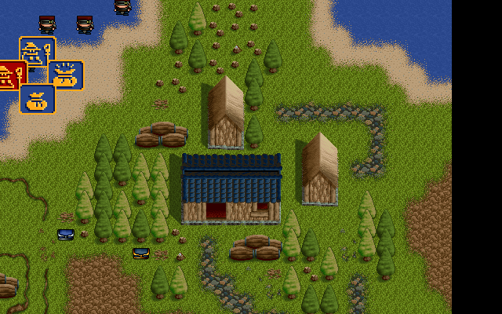 |
| action overlay 4-open / 4-close | 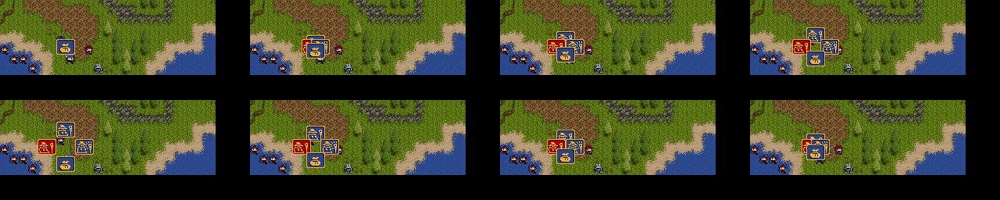 |
| 原版 indexed item/status panel（`0x17eef+0x17fc0+0x184c0`；現亦由商店獨立equip production owner使用） | 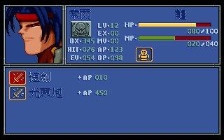 |
| 原版 indexed status command/MP overlay（`0x17aed→0x1ceed`；原版資源 fixture，非 DOSBox 截圖） | 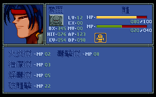 |
| 原版 indexed 物品轉交列表（`0x2e0bd→0x2dc55(mode=1)`；原版資源 fixture，非 DOSBox 截圖） | 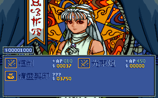 |
| 原版 indexed 目的物品欄滿提示（`0x2f8ea`／FDTXT506＋FFFC 動態姓名；非 DOSBox 截圖） | 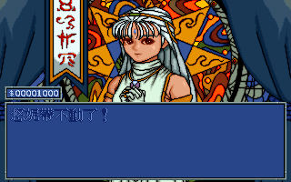 |
| preparation / church | 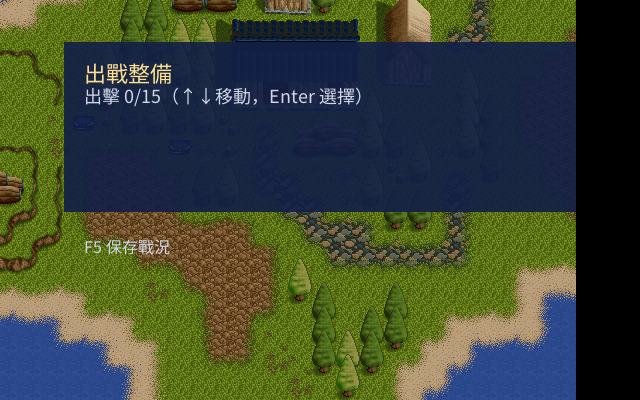  |
| 最新 campaign town hub（source rebuild, 2026-07-27） | 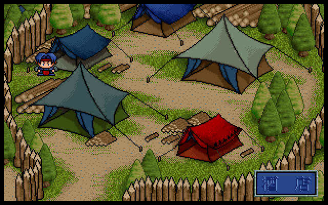 |
| 最新 campaign preparation（source rebuild, 2026-07-27） | 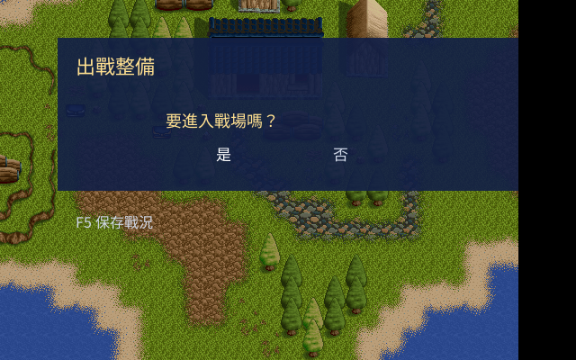 |
| 最新 campaign shop（source rebuild, 2026-07-27） | 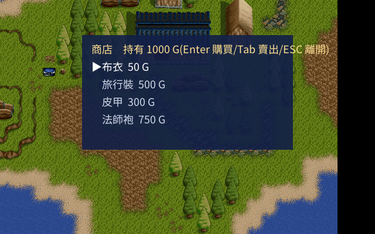 |
| 原版資源 indexed 商店主選單（`0x2e341→0x1956b→0x2d669/0x2d9fe`；variant0、DATO#129、gold與selected-pulse fixture；非 DOSBox 截圖） | 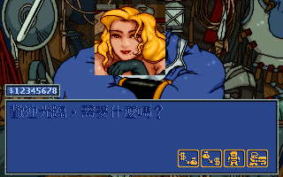 |
| 原版資源 indexed 購買商品 child panel（`0x2e0bd→0x2dc55(mode0)`；item0–5／full-price fixture，非 DOSBox 截圖） |  |
| 原版資源 indexed 賣出商品 child panel（`0x2f642→0x2e0bd(mode1)→0x2dc55`；同item0–5／3⁄4-price fixture，非 DOSBox 截圖） | 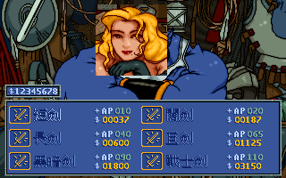 |
| 原版資源 indexed 購買確認（`0x2f0b0→0x1956b→0x19953`；動態商品名／50元、Yes/No selected-pulse fixture，非 DOSBox 截圖） | 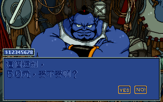 |
| 原版資源 indexed 金額不足回饋（`0x197e5` choice-close最後一幀，再於 literal VGA `0xac44c`／`(12,157)` 追加第三行；非 DOSBox 截圖） | 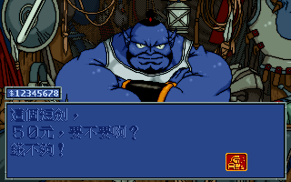 |
| 原版資源 indexed 消耗品收件者（type≥`0x20` 的 `0x2e6b8` 兩欄六人名冊；非裝備比較面板、非 DOSBox 截圖） | 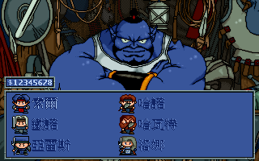 |
| 原版資源 indexed 收件者滿欄回饋（`word_5265f`＋FFFC 動態姓名；非 DOSBox 截圖） | 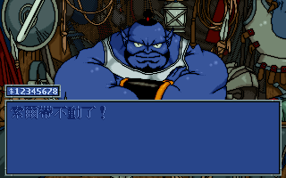 |
| 原版資源 indexed 裝備收件者比較（type<`0x20` 的 `0x2e8cf→0x2ebe0/0x2efb7`；三列 AP/DP/HIT/EV 現值→候選值，非 DOSBox 截圖） | 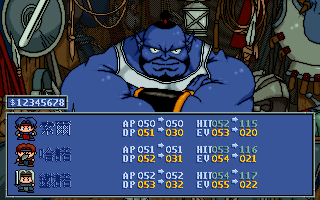 |
| 原版資源 indexed 一般商店購買成功序列（`0x2f4c6` variant1，entries23..27 五幀＋portrait restore contact sheet；非 DOSBox 截圖） | 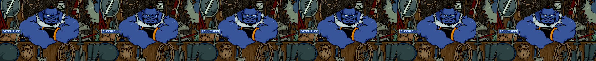 |
| 最新 campaign church（source rebuild, 2026-07-27） | 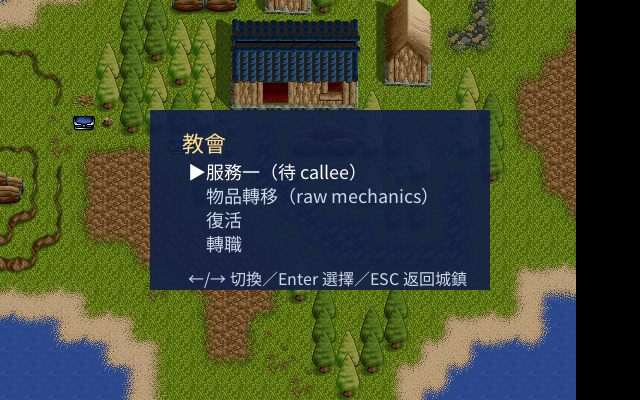 |
| ch01 原版戰場 HUD（原版錄影 434.5 秒；camera/cursor 與下列 remake 對齊） | 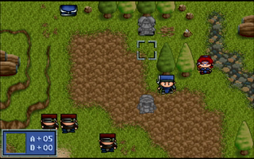 |
| ch01 原始 indexed tactical frame（修正 `work+0x8088` HUD base, 2026-07-28） | 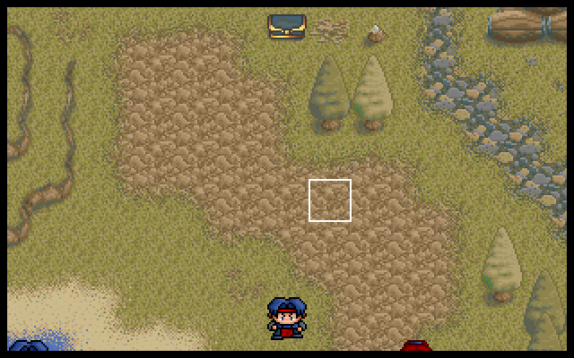 |
| 最新 church class-change contract（source trace, 2026-07-27） | [`town-church-class-change-ch02.json`](docs/data/ui-traces/town-church-class-change-ch02.json) |
| 原版資源 indexed 轉職候選清單（`0x311DC+0x31019` final frame；非 DOSBox 截圖） | 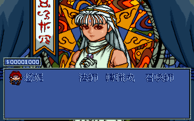 |
| 原版資源 indexed 轉職確認框（`0x19953` selected-pulse frame；非 DOSBox 截圖） | 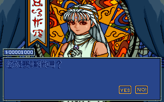 |
| 原版資源 indexed 復活候選清單（`0x30c22→0x30a47`；raw class5、Lv4 fixture，非 DOSBox 截圖） | 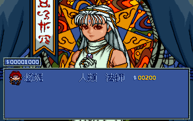 |
| 原版資源 indexed 復活確認框（FDTXT590 動態名字／費用；非 DOSBox 截圖） |  |
| 原版資源 indexed 復活訊息（FDTXT588 無候選／FDTXT504 不足金；非 DOSBox 截圖） | 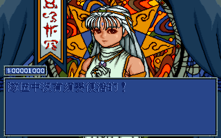  |
| 原版資源 indexed 復活成功演出（`0x2f4c6` case4 第5幀／DAC delta62；非 DOSBox 截圖） |   |
| 原版資源 indexed 教會主選單（`0x3072f+0x2d669+0x2d85f`；gold=1000 fixture，非 DOSBox 截圖） | 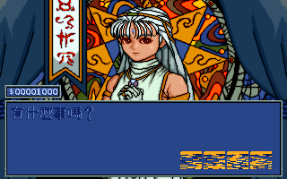 |
| 原版 DOSBox 標題／對話 oracle；右側舊圖僅為 raw decode，尚無同狀態 remake runtime 對照 | 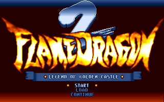  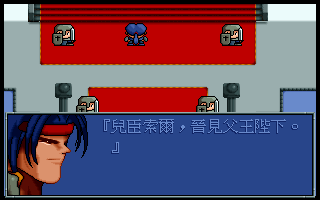  |
| battle command／load UI 切片 | 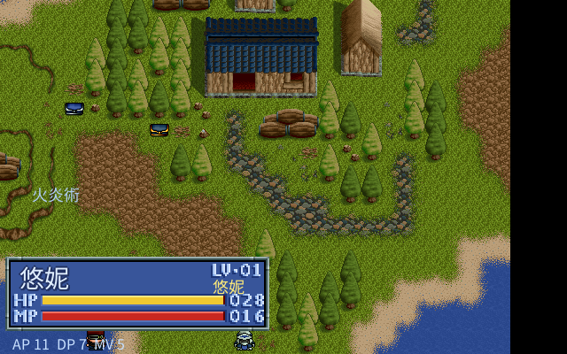 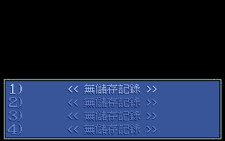 |

為 1995 年的台灣遊戲留下可重現的技術紀錄；完整遊戲 parity 仍是進行中的工程，不作提前宣稱。

本輪新增：對話嘴型節拍已依合法 IDA `0x16D00` 證據整理為可測試的
`remake/internal/dato.MouthState`（每 2 frame tick、閉嘴隨機 2–31 tick、開嘴 1 tick，選用 DATO m0/m3），
並接入重製對話更新迴圈。這是可驗證的 UI 子系統進展，不等於所有 DATO 資源、框圖排版或 30 章流程已還原。

劇情接線 coverage 可用唯讀工具重查：`python3 tools/audit_story_script_coverage.py`。
目前 `campaign_full.json` 有 121 個 story/cutscene 節點：9 個 direct script、45 個 handler-bound；
其餘 67 個分成 30 個 retreat、23 個 rumor、10 個 unbound postbattle、4 個 generic story fallback；
10 個 unbound postbattle 另有 generated binding skeleton（全節點共 24 個，含 14 個 active handler 的對照檔），
但未經 override/compile gate 不算 active handler。
工具不會依章號自動套劇本，避免把 pre/post/分支 scene 誤接。
逐項缺口可用唯讀 `python3 tools/audit_postbattle_binding_gates.py` 檢查；目前 10 個仍是
blocked；ch04/ch05/ch08/ch09/ch10/ch11/ch12/ch13/ch15/ch18/ch19/ch24/ch25 已以 compiler regression 驗證並提升為 active handler；ch05/ch08/ch09/ch11/ch13/ch19/ch24/ch25 的 acting resources 由 Docker exporter 逐幀解碼，其餘 mapping-complete 檔仍不會自動寫回 `handler_binding`。

同輪亦固定 `0x24618` indexed transition 的 raw buffer 邊界：staging offset `32904`、stride `456`、
viewport `312×192`，以及 `0x11EB0` 複製到 320-byte VGA stride 的契約；descriptor 解碼與 indexed compositor
仍未接入，故不把它宣稱成已完成的轉場演出。

另外已確認 `0x4DB9C` 只是 `(LUT, count, pixels)` 的原地索引重映射，`0x24618` 的 `9..1` 是
FDOTHER#3 的 LUT bank entry，而不是新的圖像 descriptor；此 selector 已資料化並測試，runtime compositor 仍保持 fail-closed。

目前也已有可測試的純 indexed transition frame primitive：`indexedmap.ComposeNativeTransitionFrame` 依原版順序組合
terrain、unit/foreground redraw、兩段 LUT 與 312×192 viewport copy；它需要玩家提供的完整 raw banks，尚未接入 campaign runtime 或 Ebiten 場景切換。
Map JSON 的 `native_tile_blit_modes`／`native_terrain_control` 也已嚴格讀取；前者只作
FDFIELD provenance，runtime 會依原版 `0x4dbfc` 初始化為 `0xff`，再由 `0x14818`
建立 target grid。舊版 PNG-only map 不會被誤當成 native indexed 資產。

> 把 1995 年漢堂國際的經典戰棋 RPG《炎龍騎士團2》(Flame Dragon Knight 2) 逐步反組譯，
> 用第一性原理還原規則與素材，並以 Go/Ebiten 建立可擴充的重製引擎；網頁／手機是後續目標，
> 目前不宣稱已完成跨平台 runtime parity。

這是一個**乾淨重寫**的逆向工程專案：以原版 DOS 程式作為「行為真值 oracle」抽取演算法、
破解原版資料格式，再手寫可公開、可維護、易中文化的引擎。原版程式與素材受著作權保護，
**不包含在本倉庫中**，玩家須自備合法原版。

## 為什麼這個專案值得做

《炎龍騎士團2》是 1990 年代華文單機 SRPG 的代表作之一。本專案從零開始，
把它的封裝、資產、數值與規則一塊塊還原成公開知識，並以垂直切片驗證重製方向；完整跨平台可玩版本仍在開發。

## 第 1 輪成果：`.DAT` 容器格式全破

漢堂把幾乎所有資產打包成同一種極簡歸檔容器。第 1 輪即破解並驗證此格式，
寫成一支**通吃全部 12 個 `.DAT`** 的解包器，解出約 1000 個資源：


關鍵的已驗證發現：

| 項目 | 發現 |
|---|---|
| 容器 | `LLLLLL` magic + uint32 LE offset 目錄，`N = (offsets[0]-6)/4` |
| 圖像 | uint16 寬高開頭 — 標題 320×200、戰鬥背景 320×100、圖塊 24×24(VGA mode 13h) |
| 調色盤 | `FDOTHER` 第 0 資源 = 768B = 256 色 ×RGB(6-bit) |
| 文本 | `FDTXT` 兩層結構，資源內含 uint16 字串次目錄(中文化核心) |
| 地形 | `FDSHAP@0x2422E` 300 格 ×4B，與青衫攻略 modify2 **交叉吻合** ✓ |

```bash
# 解包任一 .DAT(需自備原版)
python3 tools/unpack_dat.py --list  FLAME2/TITLE.DAT
python3 tools/unpack_dat.py --all   FLAME2/  extracted/
```

## 第 2 輪成果：圖像 / 音樂 / 數值 / 工具考證

**圖像壓縮全破** — 還原出遊戲標題畫面與所有戰鬥背景：


- **RLE 壓縮**破解(`c≥0x80` literal / `c<0x80` run)+ VGA 256 色調色盤 → 約 125 張全幅圖可解。詳見 [`05-image-compression-format.md`](docs/knowledge-base/05-image-compression-format.md)。
- **音樂**確認為 Miles AIL 的 **XMIDI**，寫 `tools/xmi2mid.py` 轉出 15 首標準 MIDI(音符平衡、tempo 保留)。詳見 [`07-music-xmidi-format.md`](docs/knowledge-base/07-music-xmidi-format.md)。
- **EXE 數值表**已將目前已定位的物品 215、法術 36、敵我單位 68 與部分成長表 dump，並與攻略交叉驗證；仍有未定位欄位，不宣稱所有 runtime 表已閉合。見 [`docs/data/exe_tables/`](docs/data/exe_tables/)。

## 第 3 輪成果：文本與中文字型全破

DOS 原生不顯示中文。當年漢堂的做法是**自帶一套點陣字型 + 用內部索引存文本**。第 3 輪把兩者都還原了：


- **文本格式**：FDTXT 是 uint16 字模索引序列(非 Big5)+ 控制碼 + `0xFFFF` 結尾，共 1016 條字串、約 5.8 萬字。
- **自製字型**：`FDOTHER` 資源 #4 = 1824 個 **16×16 1bpp** 字模；索引 0–35 是數字英文，其後為漢字。
- 把兩者一對映，原版畫面文字即完整還原成可讀繁體中文。詳見 [`08-text-and-font-format.md`](docs/knowledge-base/08-text-and-font-format.md)。


## 戰鬥動畫 codec 全破：2118 幀逐幀還原

全專案最硬的一關。原版自製動畫工具 **AFM（作者 Lo Yuan Tsung, 1993）** 的戰鬥動畫，
用一套 4 模式 sprite RLE 壓縮。經 capstone 反組譯 `FD2.EXE` 的解碼器（`0x4F43D`）、
解出每幀 13-byte 標頭、再以垂直相關分析校正真實寬度，**完整還原**：


`FIGANI.DAT` 共 **264 個動畫、2118 幀全部可解**。工具 `tools/decode_figani.py` 可輸出 PNG 序列或 GIF。
codec 與破解歷程見 [`06-animation-format.md`](docs/knowledge-base/06-animation-format.md)。

### 為台灣留一份技術紀念

逆向過程中，在動畫資料裡找到當年漢堂程式設計師自製工具的署名：

> **AFM — Animation File Manager Version 1.00　Copyright (C) 1993 Lo Yuan Tsung**

我們把破解出的每一項技術都整理成保存品質的文件，記錄 1995 年台灣團隊怎麼做一款 DOS 遊戲：
[開發工具考證](docs/knowledge-base/04-original-toolchain.md)、[圖像壓縮](docs/knowledge-base/05-image-compression-format.md)、[動畫機制](docs/knowledge-base/06-animation-format.md)、[音樂格式](docs/knowledge-base/07-music-xmidi-format.md)。

## 📖 總覽:1995 年怎麼做出這款遊戲

想一次看懂當年的全貌,先讀這篇:[**`15` 1995 年,他們怎麼做出《炎龍騎士團2》**](docs/knowledge-base/15-how-fd2-was-made-1995.md)
——把工具鏈、資料架構、畫面/動畫/音樂/中文/規則/AI 綜合成一支台灣團隊在 DOS 上做戰棋 RPG 的完整紀錄。

## 知識庫總索引

逆向發現逐輪累積在 [`docs/knowledge-base/`](docs/knowledge-base/)，每輪同步更新、錯誤知識即時修正。
`04`–`11` 同時是「1995 年台灣怎麼做遊戲」的技術保存紀錄。

**資產格式**
- [`01` 容器與資產格式](docs/knowledge-base/01-container-and-asset-formats.md) — `.DAT` 容器、圖像/調色盤/地形
- [`05` 圖像 RLE 壓縮](docs/knowledge-base/05-image-compression-format.md) — 壓縮演算法完整規格
- [`06` 動畫機制(AFM)](docs/knowledge-base/06-animation-format.md) — sprite RLE codec、2118 幀逐幀還原
- [`07` 音樂 XMIDI](docs/knowledge-base/07-music-xmidi-format.md) — Miles AIL、轉標準 MIDI
- [`08` 文本與自製中文字型](docs/knowledge-base/08-text-and-font-format.md) — 字模索引 + 16×16 字型

**遊戲邏輯 / 機制**
- [`03` EXE 資料表與資料結構](docs/knowledge-base/03-exe-and-data-structures.md) — 數值表 offset、單位/物品/法術/地圖結構
- [`09` 劇情與對話](docs/knowledge-base/09-story-and-dialogue.md) — 對話結構、說話者、抽取方法
- [`10` Sprite 繪製:敵/我方與狀態](docs/knowledge-base/10-sprite-rendering-camp-and-state.md) — 陣營著色、解碼器變體、面向
- [`11` 戰場 AI:敵人/NPC 行動決策](docs/knowledge-base/11-enemy-ai.md) — 目標評分、移動、地形評估
- [`12` 音樂播放與場景切換](docs/knowledge-base/12-music-playback-and-scene.md) — Miles AIL、XMIDI 序列、換曲流程
- [`13` 戰場選單與行動系統](docs/knowledge-base/13-battle-menu-system.md) — 行動狀態機、選單游標、Get_EasyMagic
- [`14` 文本控制碼與對話框機制](docs/knowledge-base/14-text-control-codes.md) — 開框/頭像/換行/翻頁、文字渲染器
- [`16` 音色合成:SoundFont/MT-32/版本切換](docs/knowledge-base/16-audio-synthesis-soundfont-mt32.md) — 什麼是 SoundFont、MDI 驅動、MT-32 渲染(已實證)
- [`17` 擴充劇本/玩法可行性評估](docs/knowledge-base/17-scenario-expansion-evaluation.md) — 加戰場/對話/商店/新機制怎麼做
- [`18` 字型現代化規劃:UTF-8 + TTF](docs/knowledge-base/18-font-modernization-utf8-ttf-plan.md) — 重製改用 TTF 渲染的計畫
- [`19` 劇本/關卡腳本系統設計](docs/knowledge-base/19-scenario-script-system-design.md) — 可分支節點圖、敗北路線、自創戰場(`docs/data/campaign_sample.json`)
- [`20` 第一性原理:重製可行性確認](docs/knowledge-base/20-first-principles-feasibility.md) ・ [`21` Go/Ebiten 重製架構](docs/knowledge-base/21-go-ebiten-remake-plan.md) ・ [`22` 重製技術驗證](docs/knowledge-base/22-remake-tech-validation.md)

**引擎控制流 / 深度反組譯(第 5–7 輪)**
- [`23` 開機/標題動畫/主選單/劇情自動過場](docs/knowledge-base/23-boot-title-and-scenario-flow.md) — 頂層狀態機(真 main 0x25bf4、`[0x53c03]` 章節驅動)+ 解圖驗證標題立繪捲動與 FLAME DRAGON logo
- [`24` Call-graph 逐步反組譯紀錄](docs/knowledge-base/24-callgraph-analysis-log.md) — 遞迴可達反組譯釘死 cutscene→戰場鏈、`[0x53ecc]` 戰役迴圈狀態機,排除線性 sweep 偽命中
- [`31` 地圖單位 sprite(FDICON Q版小人)](docs/knowledge-base/31-map-unit-sprites-fdicon.md) — 1680×24×24 待機動畫;與 FIGANI 戰鬥全身分工
- [`25` 戰場事件系統](docs/knowledge-base/25-battle-event-system.md) — 三張章節跳表(`0x51b19`/`0x51d71`/`0x51de9`)+ 事件原語;FD2 事件是每章硬編碼 handler(非 byte-code VM)

**參考 / 規劃**
- [`00` 索引與標註慣例](docs/knowledge-base/00-index.md) ・ [`02` 裝備/法術/人物/公式(攻略)](docs/knowledge-base/02-game-data-reference.md)
- [`04` 當年開發工具考證](docs/knowledge-base/04-original-toolchain.md) ・ [`90` 逆向與重製計畫](docs/knowledge-base/90-re-plan.md)
- [`91` Worklist](docs/knowledge-base/91-worklist.md) ・ [`99` 逐輪反思日誌](docs/knowledge-base/99-reflections-log.md)

### 文件閱讀路線（避免把 RE 筆記當成完成度）

1. **先看本 README 的狀態表**：只描述可驗證的引擎切片與主要差距。
2. **看 [`56` SDD](docs/knowledge-base/56-fd2-remake-sdd.md)**：核心 evidence gate／fail-closed 規範；UI 細項另看 [`57` matrix](docs/knowledge-base/57-ui-evidence-matrix.md)。
3. **看 [`42` gap audit](docs/knowledge-base/42-re-vs-remake-gap-audit.md)**：以玩法功能整理原版／重製差距。
4. **看 [`91` worklist](docs/knowledge-base/91-worklist.md)**：逐項工程狀態；`[x]` 是已驗證項目、`[~]` 是部分閉合、`[ ]` 是未完成。
5. 其餘編號文件是**專題證據與歷史推導**（資產 codec、UI、handler、戰鬥規則），不應單獨用來推算整體完成百分比；重複或過時斷言以 SDD、gap audit、worklist 的最新勘誤為準。

## 🎮 重製進度（Go/Ebiten）

[`remake/`](remake/) 是可公開建置的 Go/Ebiten 引擎與資料驅動腳本。現在最可靠的描述是
「多個垂直切片已可測試」，不是「全 30 章已等價通關」。已接上的範圍包括：

- 地圖／游標／相機、flood-fill 移動、地形成本、基本戰鬥與部分 AI；
- 可編輯對話／事件節點、部分 chapter pre/post handler、敗北／retreat 路線；
- 商店／祕密商店、persistent party/save、preparation 與 church/class-change 的可操作切片；
- 原版 input evidence 對應的 command overlay、對話文字與數張原版比對畫面。

仍未達原版等價的主要範圍：

- 完整 30 章逐章 playthrough 與每一場戰後 town/shop/preparation 順序回歸；
- 未追蹤 item rows／indexed effect presentation、完整 roster/save compatibility、indexed HUD/ending compositor；
- 全部原版音訊 runtime、DOS timing、跨平台打包實機驗證。

這些差距由 SDD 的 evidence gate 與 worklist 狀態標註；未知 handler 不會以猜測性 normalized
邏輯接入。AFM VM、文字、地圖與資料 codec 已可由玩家自備原版資產重現，但那不等於 campaign parity。

可行性 [`20`](docs/knowledge-base/20-first-principles-feasibility.md)、架構 [`21`](docs/knowledge-base/21-go-ebiten-remake-plan.md)；WASM 編譯驗證屬技術切片，不代表瀏覽器版已完成。

### 🎬 開場動畫:一個 1993 年的「繪圖位元組碼 VM」

開場那段「氣勢磅礡」的過場,反組譯後發現不是逐幀點陣圖,而是漢堂自製動畫工具
**AFM(Animation File Manager v1.00,Lo Yuan Tsung 1993)** 的產物——本質是一台
**10-opcode 的增量繪圖虛擬機**:每一幀是一小段位元組碼腳本,對「上一幀殘留的畫面」做
疊加操作(整屏 RLE / 局部貼圖 / 調色盤更新),**不清空重畫**。這是那個年代用小體積驅動
大畫面的經典差分壓縮設計(96 幀的金鎖動畫僅約 1MB,而非 96×64000=6MB 的全幀陣列)。

```
每幀:  [compSize u16][cmdCount u16][保留×2]  後接 cmdCount 條指令
指令:  op 0-3 → 操作 768B 調色盤(填/載入/RLE/局部貼補)
        op 4-9 → 直寫 VGA 0xA0000(填/載入/RLE/單點/區段填/區段貼圖)
```

派發器 `0x36c9e` + 跳表 `0x5276a`;播放器 `0x020421(index, delayMs, skippable)`,
`delayMs` 是真毫秒(開機時 `0x3dc9f` 用 INT21h 量測機器速度做忙等校準)。289 幀
(9 個資源)逐位元組驗證無誤,已**移植成純 Go VM**([`internal/afm`](remake/internal/afm/))在
remake 執行期直接解玩家自備的 `ANI.DAT`——引擎本身不夾帶任何版權畫格。完整格式與位址見
[`39` AFM 動畫 VM](docs/knowledge-base/39-ani-afm-format.md)。

### 🎵 音樂:兩種音源、每首都溯源到呼叫點

原版音樂是 Miles AIL 的 XMIDI 序列,靠音效卡即時合成——**同一首曲子在不同音效卡上是不同聲音**。
本專案把「哪個場景播哪首曲」與「怎麼合成」兩件事都反組譯還原:

- **曲號溯源**:`play_bgm`(`0x25977`)全 32 處呼叫逐一反組譯,把「場景 → 曲號」釘死到呼叫點,
  不靠聽曲風猜:**標題曲**=track 18(boot 鏈唯一呼叫)、**戰鬥曲**=每章查表(`0x51e63`,主戰曲
  穿插特定章)、**城鎮/商店**=track 10。過程推翻了兩個憑印象的舊推定(見 [`12`](docs/knowledge-base/12-music-playback-and-scene.md))。
- **兩種音源、可即時切換(F2)**:
  - **Roland MT-32** —— XMI → MIDI → [munt](https://github.com/munt/munt)(真 Roland ROM 逐週期模擬)。音色圓潤、偏管弦。
  - **Sound Blaster / AdLib(FM)** —— 用遊戲**自帶的** `SAMPLE.AD` FM 音色庫:自寫
    [`gtl2wopl.py`](tools/gtl2wopl.py) 把 Miles AIL 音色庫轉成 WOPL,經 libADLMIDI(Nuked OPL3)渲染。
    這是原版**出廠預設**音效卡、多數玩家記憶中的聲音——量測上頻譜重心是 MT-32 版的 2.6 倍,更亮更有衝擊感。
- 兩套皆**玩家自備原版檔案在本機渲染**(ROM / 音色庫都不隨倉庫散布),引擎只提供管線與切換。

### ✨ 重製的核心增值:可擴展事件系統(不只是複刻)

原版每關事件是**編進 EXE 的 C 函式**(改一個事件就得改程式重編);我們把它反組譯出機制後,在 remake 做成
**開放的資料驅動事件系統** —— `trigger → when → do` 三層 DSL + 文本內嵌 **事件控制碼 `{{verb:args}}`**:

```
索爾:這座城就交給你們了…{{flag:set:city_handed}}
{{branch: "追上去" -> [spawn:hanno@10,4]   "留下防守" -> [spawn_wave:defenders]}}
```

→ 新增事件、分支劇情、自創戰役以資料驅動，目標是**只改腳本、不改引擎**；原版 30 關的逐章轉換與 parity
仍在進行中，尚不能宣稱已用同一套 DSL 忠實重現。
玩家自製戰役。完整設計見 [`29` 可擴展事件系統](docs/knowledge-base/29-remake-extensible-event-system.md)。這是 remake 相對原版「擺脫固定 33 路線」的關鍵。

### ⚔️ 戰鬥演出：局部原版對照（非整體 renderer parity）


下圖是亞雷斯 vs 盜賊的一個可重現對照切片。**動畫不是手調的**——已反組譯的資料／codec
與原版截圖可用來驗證局部位置與幀資料；這不代表所有 command、HUD、ending renderer 都已等價：

- **每幀自帶絕對螢幕座標**:FIGANI 幀標頭 +0/+2 就是該幀的 (x,y)@320×200——旋轉蓄力、劈擊、
  突刺的「走位」全燒在資料裡,引擎每幀照著貼即可([`06`](docs/knowledge-base/06-animation-format.md))。
- **無 runtime 縮放 / 翻轉**:守方小、攻方大、朝向,全是美術畫進素材(blit `0x4e63d` 原生尺寸,[`35`](docs/knowledge-base/35-battle-animation-rendering.md))。
- **狀態欄 = 素材拼裝**:框(FDOTHER#5 LMI1 #22,codec `0x4e916` 破解)+ 數字 cell(#31-40)+
  血條逐欄填充;**框與數字經模板匹配驗證與原版像素全等(err=0)**。
- **命中閃紅 = VGA DAC 色盤操作**(`0x11d40`):重製以全紅剪影交替重現。
- **台座／透明輔助層仍待 renderer evidence**：`0x29164` 的 caller 參數與 TAI.DAT auxiliary bytes 已重新標為 opaque；不可把它直接宣稱成可見台座素材或固定視角設計。

五階段分鏡對照（蓄力 → 大弧 → 劈中 → 突刺 → 收勢）:


網格量測驗證(10px 網格;figure / 台座 / 狀態欄以 sprite 模板匹配確認 dx=dy=0):


> 對齊方法論:**不用 debugger**(DOSBox vanilla 無法 dump)——以「已破解的解碼器 + 原版截圖」當
> oracle,用 sprite 模板匹配反推每個元素的精確落點,再回頭從反組譯確認機制(如幀內嵌座標)。

## 重製目標

| 技術棧 | 目標平台 | 狀態 | 參考專案 |
|---|---|---|---|
| **Go / Ebiten** | Web(WASM) / Android | **開發中**（垂直切片；非全 30 章 parity） | 《魔法大帝》重製 |
| **SDL2 + C++** | 桌面(Linux/Windows/Mac) | 規劃中 | 精訊《勇者鬥惡龍三》重製 |

Go/Ebiten 是目前唯一持續整合的引擎線；SDL2+C++ 仍是歷史規劃，不宣稱已有第二套 runtime。共同資料／規則是架構意圖，詳見 [`90-re-plan.md`](docs/knowledge-base/90-re-plan.md)。

## 逆向工具索引

全部在 [`tools/`](tools/),Python(走 docker uv/capstone,不污染系統)或 shell。資產輸出到本機 `extracted/`(不入庫)。

**解包 / 解碼(資產 → PNG/MIDI)**
| 工具 | 用途 |
|---|---|
| `unpack_dat.py` | 解 `.DAT` 的 LLLLLL 容器(`--list` / `--all`) |
| `decode_image.py` | 圖像 RLE 解碼(背景/標題圖) |
| `decode_figani.py` | 戰鬥動畫 sprite RLE(4-mode)逐幀解碼 |
| `decode_sprite.py` / `decode_dato.py` | sprite / DATO 人物頭像解碼 |
| `dump_remap.py` | FDOTHER#3 LMI1 陣營/狀態著色 LUT |
| `font_grid.py` | 自製字型 16×16 字模網格匯出 |

**反組譯(DOS4GW LE)**
| 工具 | 用途 |
|---|---|
| `disasm_le.py` | LE 反組譯(`dis`/`range`/`calls`/`refs`,標 fixup target) |
| `callgraph_le.py` | 遞迴可達 call-graph(`reach`/`callers`/`rpath`/`funcof`/`jtab`)— 釘 caller、解跳表 |
| `le_xref.py` | LE fixup 重定位 + 字串/資料 xref |
| `dump_exe_tables.py` | EXE 數值表 dump(單位/物品/法術/成長) |

**地圖 / 文本 / 音訊**
| 工具 | 用途 |
|---|---|
| `parse_field.py` / `extract_maps.py` / `render_map.py` | FDFIELD 三段解析、全戰場抽取與渲染 |
| `export_engine_assets.py` | 戰場 → 引擎資產(tileset.png + map.json) |
| `decode_text.py` / `encode_text.py` | 文本 glyph↔Unicode 解碼 / 回寫編碼 |
| `decode_story_text.py` / `render_story.py` | 全 35 章劇情解碼成 UTF-8 / 渲染 |
| `xmi2mid.py` / `export_mt32.sh` / `export_music_ogg.sh` | XMIDI→MIDI、MT-32 渲染、預錄 OGG |
| `extract_all.py` | 一鍵重生 `extracted/`(所有素材) |

## 倉庫結構

```
docs/knowledge-base/   逆向知識庫(格式、RE 證據、SDD、worklist 與歷史記錄)
docs/data/             結構化資料(glyph_map.json、campaign_sample.json…)
docs/figures/          圖解(SVG + PNG)
tools/                 逆向工具(見上「逆向工具索引」)
remake/                Go/Ebiten 重製(引擎碼入庫,資產不入庫)
references/README.md   青衫攻略致謝與連結(原文不轉載)
org_game/              原版本體與素材(.gitignore,不散布)
extracted/             抽取素材(.gitignore,由 tools/extract_all.py 重生)
```

## 致謝與版權

- 遊戲《炎龍騎士團2》著作權屬**漢堂國際**。本專案僅供研究、保存與技術重製，原版資產不散布。
- 攻略知識庫取材自圖文攻略作者**青衫**：<https://chiuinan.github.io/game/game/intro/ch/c31/fd2/>。
  本倉庫不轉載其原文與圖片，僅做結構化數值整理並標註出處。
