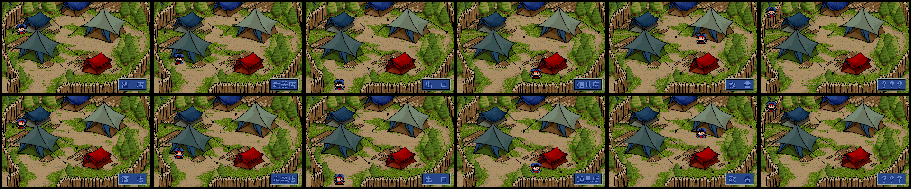
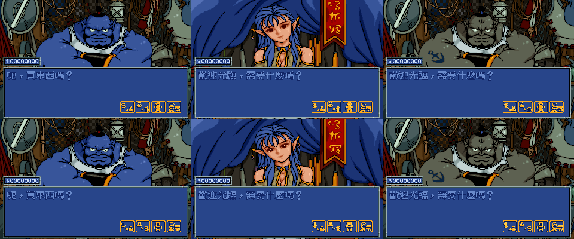
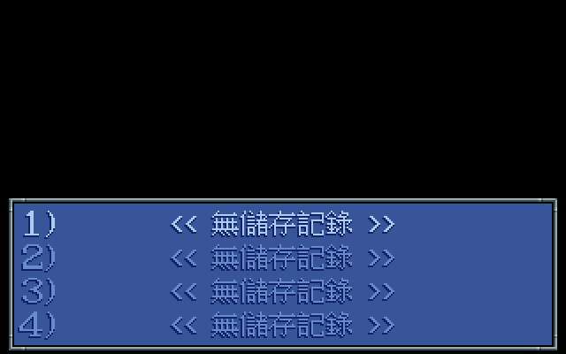

# 炎龍騎士團 2 反向工程與重製

本專案以合法原版《炎龍騎士團 2：黃金城傳說》作為行為基準，保存 DOS
程式的資料格式、介面與遊戲機制，並以 Go／Ebiten 建立可編輯、可擴充的
潔淨室重製引擎。

目前已有多個可操作、可比較的垂直切片，但**尚未達成 30 章原版等價通關**。
原版程式與美術、文字、音樂等受著作權保護的資產不包含在本倉庫中；使用者
必須自備合法原版。

## 目前進度

| 領域 | 已驗證成果 | 主要缺口 |
|---|---|---|
| 資產與格式 | `.DAT`、RLE 圖像、FDTXT／字型、AFM／FIGANI、XMIDI、地圖與部分 EXE 資料表可重現解析 | 部分執行期改寫、合成器與音訊播放尚未完整接入 |
| 反向工程 | 戰役狀態機、事件處理器、戰鬥規則、敵方 AI、城鎮／商店／教會及存檔邊界已有證據化切片 | 未知處理器、完整敵方回合、逐章戰後流程與原生存檔還原仍採失敗即關閉 |
| Go／Ebiten 重製 | 地圖、對話、部分戰鬥、城鎮、商店、教會、整備及自有存檔可操作 | 尚缺完整 30 章玩家路徑、完整原生存檔相容、結局、音訊與跨平台驗收 |
| 原版視覺比對 | ch02 城鎮與部分商店、讀檔選單等狀態已有 320×200 整幀 RGB 相同證據 | 完整操作介面估計約 40–45%；戰場、整備、教會與其餘章節仍需同狀態比較 |

工作清單中的完成項代表已驗證的函式、格式或切片，**不是遊戲完成百分比**。
資產解碼完成也不等於玩法、介面或戰役流程已完成。

所有文件中的 `FD2.EXE` 位址目前只適用於大小 `357074` 位元組、MD5
`b97caf2239a27a896069d03549d96e1e` 的版本。SHA-256 與相關檔案雜湊見
[`fd2-reference-files.json`](docs/data/fd2-reference-files.json)；版本不同時
必須重新定位，不能直接套用既有位址。

## 可驗證畫面

以下圖片只代表其標示的狀態，不可外推為整套遊戲已完成。

### 城鎮與商店

ch02 城鎮六個選項：上排為原版 DOSBox，下排為重製；每格皆有整幀相同的
對照結果。



ch02 武器店、道具店與秘密商店：上排為原版，下排為重製；這只證明圖中三個
商店主選單狀態。



### 讀檔選單

原版與重製的四個空存檔槽畫面已達整幀 RGB 相同；有效槽排版也已有相同結果，
但原生存檔成功還原仍在開發。

| 原版 | 重製 |
|---|---|
|  |  |

### 戰場與戰鬥演出

ch01 戰場目前已能由原始地圖、單位、前景與 HUD 資產合成。下列兩圖是相近
相機狀態，並非同一時刻、同一隊伍的逐像素等價證明。

| 原版參考 | 重製切片 |
|---|---|
|  |  |

戰鬥動畫解碼與局部位置比較：


完整介面覆蓋、證據等級與其餘比較圖請看
[`57-ui-evidence-matrix.md`](docs/knowledge-base/57-ui-evidence-matrix.md)。

## 快速開始

### 需求

- Docker
- 合法原版遊戲檔案
- 本倉庫不要求在主機安裝 Go、Capstone 或其他分析套件

本專案的分析、轉檔、建置、測試與抓圖一律在 Docker 內執行。可維護的容器
入口與資產匯出步驟見 [`remake/README.md`](remake/README.md) 及
[`tools/docker/`](tools/docker/)。

### 建置與測試

Go／Ebiten 是目前唯一持續整合的重製引擎：

```bash
docker run --rm --network none --memory 2g --cpus 2 --pids-limit 256 \
  -v "$PWD/remake:/src" -w /src fd2-go-test-local \
  go test ./...
```

本機映像檔的建立方式與 Web、Linux、Windows 打包入口請看
[`remake/README.md`](remake/README.md)。資產工具位於 [`tools/`](tools/)；
輸出放在被忽略的 `extracted/`，不應把原版衍生資產提交至 Git。

## 文件導航

建議依下列順序閱讀：

1. [`56-fd2-remake-sdd.md`](docs/knowledge-base/56-fd2-remake-sdd.md)：
   系統設計、證據分級、原版與重製的責任邊界。
2. [`57-ui-evidence-matrix.md`](docs/knowledge-base/57-ui-evidence-matrix.md)：
   操作介面的原版證據、重製狀態與未閉合項目。
3. [`42-re-vs-remake-gap-audit.md`](docs/knowledge-base/42-re-vs-remake-gap-audit.md)：
   從玩家功能檢視原版與重製差距。
4. [`91-worklist.md`](docs/knowledge-base/91-worklist.md)：
   目前工程佇列與驗證狀態。
5. [`00-index.md`](docs/knowledge-base/00-index.md)：
   資產格式、戰鬥、劇情、介面等專題文件索引。
6. [`SESSION-HANDOFF-2026-07-06.md`](docs/knowledge-base/SESSION-HANDOFF-2026-07-06.md)：
   時間序列證據與後續勘誤，不應單獨視為現況真值。

早期設計、歷史反思或專題筆記若與原始位元組、執行期實驗或上述現況文件
衝突，以較新的直接證據與勘誤為準。未知語意不會為了讓流程前進而猜測接入。

## 倉庫結構

```text
docs/knowledge-base/  系統設計、證據、專題研究與工作清單
docs/data/            結構化資料、原版檔案雜湊與可重播追蹤
docs/figures/         經整理的原版／重製比較圖
remake/               Go／Ebiten 重製引擎
tools/                資產解碼、反組譯與驗證工具
org_game/             使用者自備原版；不納入版本控制
extracted/            本機產物；不納入版本控制
```

## 研究與實作原則

- 原版執行檔是行為判定基準；反編譯輸出與攻略只能協助導航。
- 已證實結論必須綁定位址、原始位元組、呼叫者／消費端或同狀態實機比較。
- 寫死在原版中的對話、事件、戰後、城鎮、商店與整備流程，會轉成可編輯資料
  與具型別規則，不保留依賴原版位址的正式執行捷徑。
- 多數戰鬥結束後會進入城鎮、商店或整備，不會直接跳到下一場戰鬥。
- 除錯捷徑、修改存檔或只通過重製端測試，不等於一般玩家路徑已驗證。

協作規則與 Docker、IDA Pro、提交及證據政策見 [`AGENTS.md`](AGENTS.md)。

## 版權與致謝

- 《炎龍騎士團 2》及其原版資產著作權屬漢堂國際。本專案只提供研究紀錄、
  工具與潔淨室重製程式，不散布原版內容。
- 攻略資料參考青衫整理的
  [《炎龍騎士團 2》圖文攻略](https://chiuinan.github.io/game/game/intro/ch/c31/fd2/)；
  攻略只作玩家可見行為與數值旁證，不作二進位介面證據。
